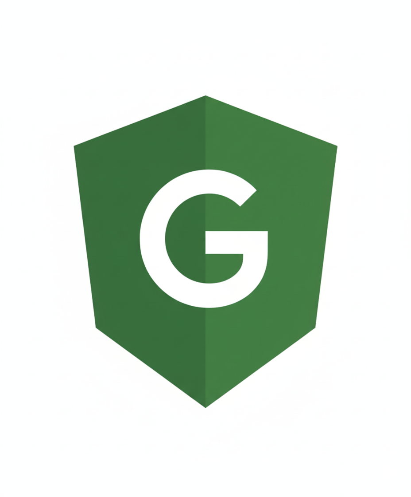

<p align="center">
  
</p>

<h1 align="center">Guardyn: Privacy-Focused Secure Communication</h1>

<p align="center">
  <strong>Open source messaging platform built on proven cryptography (Signal Protocol + OpenMLS)</strong>
</p>

<p align="center">
  <a href="#-current-status"><strong>Project Status</strong></a> •
  <a href="#-technical-approach"><strong>Architecture</strong></a> •
  <a href="#-getting-started"><strong>Get Started</strong></a> •
  <a href="docs/IMPLEMENTATION_PLAN.md"><strong>Documentation</strong></a> •
  <a href="CONTRIBUTING.md"><strong>Contributing</strong></a> •
  <a href="CODE_OF_CONDUCT.md"><strong>Code of Conduct</strong></a>
</p>

<p align="center">
  
  
  
  
  
</p>

---

## 🚀 Current Status

**Phase:** MVP Backend Complete, Mobile Client in Development (November 15, 2025)

**What's Working:**

- ✅ **Backend Services**: Auth and Messaging services operational (Kubernetes deployment)
- ✅ **Cryptography**: X3DH, Double Ratchet, OpenMLS fully implemented and tested
- ✅ **Infrastructure**: Production-ready stack (TiKV, ScyllaDB, NATS, Prometheus, Grafana)
- ✅ **Testing**: 8/8 E2E integration tests passing, performance baseline established
- ✅ **Reproducible Builds**: Nix flakes for deterministic builds

**In Active Development:**

- 🚧 **Mobile Client**: Authentication complete, messaging UI in progress
- 🚧 **Security Audits**: Planning Cure53 audit for Q2 2026
- 🚧 **Additional Services**: Presence and Media services

**Planned Features:**

- 📋 Voice/video calls (WebRTC + SFrame E2EE)
- 📋 Desktop applications (Windows, macOS, Linux)
- 📋 Post-quantum key exchange (Kyber hybrid - code ready, not enforced)
- 📋 Web client

**Public Beta Target:** Q2 2026

[Full technical roadmap →](docs/IMPLEMENTATION_PLAN.md)

---

## 🎯 Project Vision

Guardyn aims to provide enterprise-grade secure communication with the same privacy guarantees as Signal, while adding:

- **Self-hosting capability** for organizations requiring data sovereignty
- **Modern group encryption** using OpenMLS (IETF standard RFC 9420)
- **Full transparency** with 100% Apache-2.0 licensed code and reproducible builds
- **Enterprise features** (planned: LDAP, SAML, compliance tools)

**We build on Signal's foundation**, not against it. Signal pioneered the Double Ratchet protocol, and we use the same battle-tested cryptography for 1-on-1 messaging. For groups, we implement OpenMLS—the newer IETF standard designed specifically for scalable group encryption.

---

## 📱 Cross-Platform Applications

<p align="center">
  
</p>

<p align="center">
  <em>Guardyn running on Android, iOS, Linux, macOS, and Web — same encryption everywhere</em>
</p>

---

## 🔐 Why Guardyn?

### The Problem We're Solving

Modern messaging platforms face a fundamental tension:

- **Privacy-first apps** (like Signal) struggle with enterprise adoption and sustainable funding
- **Enterprise platforms** (like Slack, Teams) lack end-to-end encryption and are closed source
- **Popular messengers** (like Telegram, WhatsApp) make privacy compromises for scale

### Our Approach

**For individuals and privacy advocates:**

- Military-grade encryption (Signal Protocol + OpenMLS)
- Zero-knowledge architecture (servers can't decrypt your messages)
- Open source and auditable (Apache-2.0 license)
- Self-hosting option (full control of your data)

**For organizations:**

- Compliance-ready architecture (GDPR, HIPAA, SOC 2 target)
- Self-hosted deployment option (data sovereignty)
- Enterprise features (planned: SSO, admin tools, audit logs)
- Kubernetes-native scalability

**For high-security environments:**

- Government agencies requiring secure inter-agency communication
- Military organizations needing tactical and strategic messaging
- Intelligence services with strict data sovereignty requirements
- Defense contractors handling classified information
- Security-conscious institutions with air-gap deployment needs
- Zero-trust architecture (even we can't decrypt your data)

**For developers:**

- 100% open source (no proprietary server components)
- Reproducible builds (verify binaries match source)
- Modern tech stack (Rust, Kubernetes, gRPC)
- Formal verification (TLA+ specs, cryptographic proofs planned)

---

## 🔍 Comparison: How Guardyn Differs

### Design Philosophy

**Signal Foundation pioneered modern E2EE messaging**. The Double Ratchet protocol they created is now the industry standard, protecting billions of messages daily. We build on their work, not against it.

**Guardyn's additions:**

- OpenMLS for scalable group encryption (IETF RFC 9420)
- Self-hosting option for data sovereignty
- Enterprise features (LDAP, SAML, audit logs - planned)
- 100% open source server components (Apache-2.0)

### Technical Comparison

#### vs. Signal (Our Foundation)

| Feature             | Signal                              | Guardyn                                  | Notes                          |
| ------------------- | ----------------------------------- | ---------------------------------------- | ------------------------------ |
| 1-on-1 E2EE         | ✅ Double Ratchet                   | ✅ Double Ratchet (same protocol)        | Both use battle-tested Signal  |
| Group E2EE          | ✅ Sender Keys (proven, 2020)       | ✅ OpenMLS (IETF standard, 2024)         | Different approaches, both E2E |
| Post-Quantum        | 🚧 PQXDH in development             | 🚧 Kyber hybrid (code ready, not active) | Both working on PQ             |
| Server Open Source  | ⚠️ Most components open             | ✅ 100% open (Apache-2.0)                | Minor difference               |
| Reproducible Builds | ⚠️ Android only                     | ✅ Nix flakes (all platforms)            | Infrastructure choice          |
| Self-Hosting        | ❌ Not supported                    | ✅ Full Kubernetes deployment            | Core difference                |
| Enterprise Features | ❌ Consumer-focused                 | 🚧 LDAP, SAML (planned)                  | Different target market        |
| Track Record        | ✅ **10+ years, billions of users** | ⚠️ **New project (2025)**                | Signal has proven reliability  |
| Security Audits     | ✅ **Multiple completed**           | 📋 **Planning Cure53 (Q2 2026)**          | Signal is audit-proven         |

**Verdict:** Signal has 10 years of battle-testing and billions of users. Guardyn is a new project (2025) adding self-hosting and enterprise features to proven cryptography. If you need maximum trust, use Signal. If you need self-hosting, consider Guardyn once audited.

---

#### vs. WhatsApp (Signal Protocol + Meta)

| Feature          | WhatsApp                        | Guardyn                                    | Notes                                 |
| ---------------- | ------------------------------- | ------------------------------------------ | ------------------------------------- |
| E2EE Protocol    | ✅ Signal Protocol              | ✅ Signal + OpenMLS for groups             | Both use Signal for 1-on-1            |
| Metadata Privacy | ❌ Collected by Meta            | ✅ Minimal collection                      | Major difference                      |
| Cloud Backups    | ⚠️ Unencrypted on iCloud/Google | ✅ Local only, encrypted                   | WhatsApp has unencrypted backup issue |
| Open Source      | ❌ Closed source                | ✅ Full stack open (Apache-2.0)            | Auditability difference               |
| Business Model   | Meta advertising empire         | Open source (cloud SaaS planned)           | Fundamental difference                |
| Self-Hosting     | ❌ Not possible                 | ✅ Kubernetes deployment                   | Data sovereignty option               |
| User Base        | ✅ **2+ billion users**         | ⚠️ **In development (beta planned Q2 26)** | WhatsApp is proven at scale           |

**Verdict:** WhatsApp uses Signal's E2EE but collects metadata for Meta's advertising. Guardyn focuses on both content and metadata privacy, with self-hosting option. WhatsApp has massive scale advantage.

---

#### vs. Telegram (Convenience vs. Security)

| Feature            | Telegram                                   | Guardyn                                  | Notes                                 |
| ------------------ | ------------------------------------------ | ---------------------------------------- | ------------------------------------- |
| E2EE by Default    | ❌ Only "Secret Chats"                     | ✅ Always E2EE                           | **Critical security difference**      |
| Group E2EE         | ❌ Server can read messages                | ✅ OpenMLS (cryptographically protected) | **Telegram groups are not E2EE**      |
| Voice/Video E2EE   | ❌ Not encrypted                           | 🚧 SFrame (planned)                      | Telegram prioritizes convenience      |
| Server Open Source | ❌ Closed                                  | ✅ Apache-2.0                            | Transparency difference               |
| Crypto Review      | ⚠️ MTProto (custom, criticized by experts) | ✅ Standard protocols (Signal, OpenMLS)  | Telegram's crypto is non-standard     |
| Cloud Sync         | ✅ Convenient (server stores plaintext)    | ❌ Local only (privacy over convenience) | Different priorities                  |
| User Base          | ✅ **900+ million users**                  | ⚠️ **In development**                    | Telegram has massive user base        |
| Independent Audits | ⚠️ Limited, MTProto not widely reviewed    | 📋 Planning (Cure53 Q2 2026)             | Both need more independent validation |

**Verdict:** Telegram prioritizes convenience and cloud sync over E2EE. Most Telegram conversations are readable by servers. Guardyn enforces E2EE always, sacrificing some convenience for security.

---

#### vs. Viber (Consumer Messaging)

| Feature         | Viber                      | Guardyn                             | Notes                              |
| --------------- | -------------------------- | ----------------------------------- | ---------------------------------- |
| E2EE            | ⚠️ Optional, not default   | ✅ Mandatory, always on             | **Default security differs**       |
| Crypto Standard | ⚠️ Proprietary protocol    | ✅ Industry standards (Signal, MLS) | Guardyn uses peer-reviewed crypto  |
| Security Audit  | ❌ None publicly available | 📋 Planning (Cure53 Q2 2026)        | Both need independent verification |
| Open Source     | ❌ Closed                  | ✅ Apache-2.0                       | Transparency difference            |
| Business Model  | Ads, stickers, games       | Open source (cloud SaaS planned)    | Revenue model differs              |
| Target Market   | Consumer messaging         | Privacy-focused users, enterprises  | Different audiences                |

**Verdict:** Viber is a consumer messaging app with optional encryption. Guardyn is focused on mandatory E2EE and open source transparency.

---

### Key Takeaways

1. **We respect Signal** - they pioneered the Double Ratchet protocol we use. Their 10 years of battle-testing is invaluable.
2. **Our additions** - OpenMLS for groups, self-hosting, enterprise features, 100% Apache-2.0 license
3. **We're new (2025)** - Signal has proven reliability at scale. Guardyn is unproven but building on proven protocols.
4. **Audit status** - Signal has completed multiple security audits. Guardyn is planning Cure53 audit for Q2 2026.
5. **Use Signal if** - you want maximum trust and proven reliability
6. **Consider Guardyn if** - you need self-hosting or want to contribute to open source development

---

## 📋 Technical Foundation

### Cryptographic Protocols

**1-on-1 Messaging (Implemented):**

- X3DH key exchange (Perfect Forward Secrecy)
- Double Ratchet (Signal Protocol - same as WhatsApp, Signal)
- AES-256-GCM encryption (NIST standard)

**Group Messaging (Implemented):**

- OpenMLS (IETF RFC 9420 - 2024 standard)
- Tree-based group management (scalable to 10k+ members)
- Post-compromise security (automatic healing)

**Post-Quantum (Code Ready, Not Enforced):**

- Kyber + ECDH hybrid key exchange
- NIST PQC finalist integration
- Gradual rollout planned (Q3 2026)

**Media Encryption (Planned):**

- SFrame encryption for voice/video
- Insertable Streams API for WebRTC
- Hardware-backed key storage

### Infrastructure Stack

**Backend (Production-Ready):**

- Rust services (memory-safe, no buffer overflows)
- gRPC APIs (efficient binary protocol)
- Envoy proxy (gRPC-Web translation for browsers)
- TiKV distributed KV store (ACID transactions)
- ScyllaDB for message storage (high throughput)
- NATS JetStream (event streaming)

**Client Communication:**

- Native gRPC for mobile/desktop (direct TCP connections)
- gRPC-Web for browsers (via Envoy proxy on port 8080)
- Automatic platform detection (transparent to developers)

**Deployment (Production-Ready):**

- Kubernetes-native (k3d for local, k8s for prod)
- Horizontal scaling (3 servers + 2 agents)
- Cilium CNI (network policies, observability)
- cert-manager for TLS automation

**Observability (Production-Ready):**

- Prometheus metrics collection
- Grafana dashboards
- Loki log aggregation
- Distributed tracing (OpenTelemetry)

### Build Reproducibility

**Nix Flakes (Implemented):**

- Deterministic builds across all platforms
- Pinned dependencies (nixpkgs 23.11)
- Same binary from same source code
- SBOM generation with Syft
- Artifact signing with Cosign

### Performance Benchmarks (Current)

### Performance Benchmarks (Current)

**E2E Test Results (November 2025):**

- Auth Service: 361ms P95 latency (local k3d cluster)
- Messaging Service: 28ms P95 latency (local k3d cluster)
- 8/8 integration tests passing
- k6 performance baseline established

**Note:** These are local development benchmarks, not production performance guarantees. Production benchmarks will be published after cloud deployment.

---

## 🚀 Getting Started

### Current Status (November 2025)

**What's Working:**

**Production-Ready Backend:**

- **Authentication Service**: User registration, login, JWT auth, device management (2/2 replicas running)
- **Messaging Service**: 1-on-1 and group chat, CRUD operations, member management (3/3 replicas running)
- **Envoy Proxy**: gRPC-Web translation for browser clients (1/1 replica running)
- **Cryptography**: X3DH key exchange, Double Ratchet encryption, OpenMLS group encryption (fully implemented)
- **Infrastructure**: Kubernetes (k3d), TiKV, ScyllaDB, NATS JetStream (operational)
- **Testing**: 8/8 E2E integration tests passing, k6 performance baseline established
- **Observability**: Prometheus, Loki, Grafana monitoring stack (deployed)

**In Active Development:**

- **Mobile Client**: Authentication flow complete, messaging UI in progress
- **Presence Service**: Online/offline status, typing indicators
- **Media Service**: File uploads, encryption, thumbnails
- **Post-Quantum Crypto**: Kyber hybrid key exchange integration (code ready, not enforced)

**Planned Features:**

- Voice/video calls (WebRTC + SFrame E2EE)
- Desktop applications (Windows, macOS, Linux)
- Web client
- Enterprise features (LDAP, SAML, admin tools)

**Public Beta Target:** Q2 2026

For detailed implementation status, see [`docs/IMPLEMENTATION_PLAN.md`](docs/IMPLEMENTATION_PLAN.md).

---

### Self-Hosting (For Developers)

**Status:** Infrastructure operational, services ready for testing

**Prerequisites:**

- Nix package manager
- 16GB RAM minimum
- Docker or Podman

**Quick Start:**

```bash
git clone https://github.com/guardyn/guardyn.git
cd guardyn

# Enter reproducible environment (Nix)
nix develop

# Deploy to local Kubernetes (k3d)
just kube-create        # Create k3d cluster
just kube-bootstrap     # Install CRDs and namespaces
just k8s-deploy nats    # Deploy NATS JetStream
kubectl apply -k infra/k8s/base/tikv  # Deploy TiKV
just k8s-deploy scylladb  # Deploy ScyllaDB
just k8s-deploy monitoring  # Deploy observability
just verify-kube        # Run smoke tests

# Access Grafana at http://localhost:3000
# Default credentials: admin/admin
```

**Full setup guide:** [`docs/infra_poc.md`](docs/infra_poc.md)

**Current Limitations:**

- Backend services operational but mobile client incomplete
- Recommended for developers and early testers only
- Not production-ready for end users yet

---

## 🛡️ Security

### Cryptographic Guarantees

**What we implement:**

- ✅ **End-to-end encryption**: X3DH + Double Ratchet for 1-on-1, OpenMLS for groups
- ✅ **Perfect Forward Secrecy**: Compromised keys don't expose past messages
- ✅ **Post-Compromise Security**: OpenMLS provides automatic key healing
- ✅ **Deniable authentication**: Cryptographic plausible deniability (Double Ratchet property)

**What we DON'T claim:**

- ⚠️ **Device security**: If your device is compromised, encryption can't help
- ⚠️ **Screenshot protection**: Recipients can take screenshots (unavoidable)
- ⚠️ **Network anonymity**: ISPs see IP addresses (use Tor/VPN for anonymity)
- ⚠️ **Metadata elimination**: We minimize but can't eliminate all metadata (routing requires some)

### Security Audits

**Status:** No independent security audits completed yet.

**Planned:**

- Cure53 audit scheduled for Q2 2026
- Cost: $50k-$100k (fundraising in progress)
- Scope: Cryptographic implementation, server infrastructure, client security

**Current verification:**

- Backend code review by team
- E2E integration tests (8/8 passing)
- Cryptographic protocols are industry standards (Signal, OpenMLS)

**Security Policy:** See [SECURITY.md](SECURITY.md) for responsible disclosure process.

---

## 📖 License

**Guardyn is 100% open source under Apache-2.0 license.**

- All code (backend, frontend, clients) is Apache-2.0
- No dual licensing
- No "Enterprise Edition" with withheld features
- Free forever, self-host anywhere

See [LICENSE](LICENSE) for complete terms.

**Future Business Model:**

- Managed cloud hosting (SaaS) planned for Q2 2026
- Enterprise features (LDAP, SAML, admin tools) will be developed as open source when funded
- Sustainable through services, not licensing restrictions

See [NOTICE](NOTICE) for third-party attributions.

---

## 🤝 Contributing

We welcome contributions! However, please note:

**Project Status:** MVP backend complete, mobile client in development

**How to Contribute:**

1. **Code:** See [CONTRIBUTING.md](CONTRIBUTING.md) for guidelines
2. **Security:** See [SECURITY.md](SECURITY.md) for vulnerability disclosure
3. **Documentation:** Help us improve docs in `docs/`
4. **Testing:** Run E2E tests and report issues

**Community:**

- GitHub Issues: Bug reports and feature requests
- Discussions: Architecture and design questions

---

## 🗺️ Roadmap

### Completed (November 2025)

- ✅ Backend MVP (Auth + Messaging services operational)
- ✅ Cryptography (X3DH, Double Ratchet, OpenMLS)
- ✅ Infrastructure (Kubernetes, TiKV, ScyllaDB, NATS)
- ✅ E2E Testing (8/8 tests passing)
- ✅ Observability (Prometheus, Grafana, Loki)

### Q1 2026

- 🚧 Complete mobile client messaging UI
- 🚧 Presence service (online/offline status)
- 🚧 Media service (file uploads, encryption)
- 📋 Desktop clients (Electron-based)

### Q2 2026 (Public Beta Target)

- 📋 Security audit (Cure53)
- 📋 Voice/video calls (WebRTC + SFrame)
- 📋 Web client (PWA)
- 📋 Public beta launch

### Q3-Q4 2026

- 📋 Post-quantum enforcement (Kyber hybrid)
- 📋 Enterprise features (LDAP, SAML, audit logs)
- 📋 Managed cloud hosting (SaaS launch)
- 📋 Production v1.0 release

**Note:** Roadmap is subject to change based on resources and community feedback.

---

## 🙏 Acknowledgments

Guardyn builds on the work of pioneers:

- **Signal Foundation** - Double Ratchet protocol and E2EE advocacy
- **IETF MLS Working Group** - OpenMLS standardization (RFC 9420)
- **Rust Community** - Memory-safe systems programming
- **CNCF Projects** - Kubernetes, NATS, Prometheus ecosystem
- **Nix Community** - Reproducible build infrastructure

We stand on the shoulders of giants.

---

## 📬 Contact

- **Website:** https://guardyn.co (coming soon)
- **GitHub:** https://github.com/guardyn/guardyn
- **Security:** security@guardyn.app (for vulnerabilities only)
- **General:** hello@guardyn.app

---

## ⚠️ Project Status Disclaimer

**Guardyn is in active development (November 2025).**

- Backend MVP operational but **not production-ready for general users**
- Mobile client incomplete (authentication works, messaging UI in progress)
- **No security audits completed yet** (Cure53 audit planned Q2 2026)
- Recommended for developers and early testers only
- Use Signal or other proven messengers for critical communications until v1.0

**Target for production use:** Q3-Q4 2026 (after security audit and public beta)

---

<p align="center">
  <strong>Built with ❤️ by privacy advocates</strong><br>
  Licensed under Apache-2.0 • Copyright © 2025 Guardyn Team
</p>
