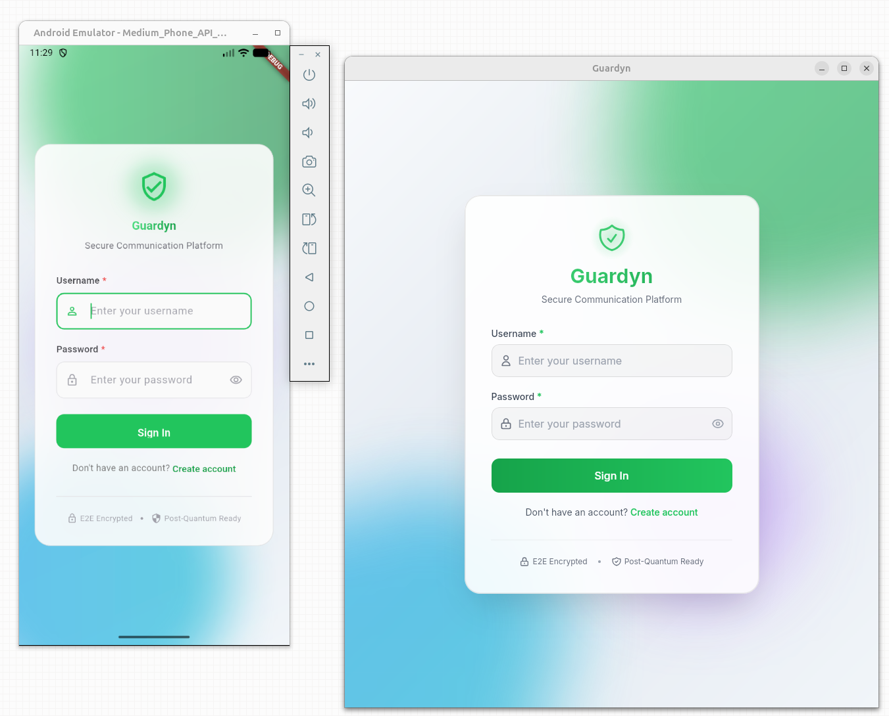

<p align="center">
  
</p>

<h1 align="center">Guardyn</h1>

<h3 align="center">Private messaging that just works 🔐</h3>

<p align="center">
  Open source • End-to-end encrypted • Self-hostable
</p>

<p align="center">
  <a href="#-quick-start-users"><strong>📱 Download</strong></a> •
  <a href="#-quick-start-developers"><strong>💻 Self-Host</strong></a> •
  <a href="#-why-guardyn"><strong>Why Guardyn?</strong></a> •
  <a href="CONTRIBUTING.md"><strong>Contribute</strong></a>
</p>

<p align="center">
  
  
  
  
</p>

---

## What is Guardyn?

**Guardyn is a private messaging app** with military-grade encryption. Unlike other messengers:

- ✅ **Open source** — you can verify everything we claim
- ✅ **Self-hostable** — run your own server if you want complete control
- 🔐 **End-to-end encrypted** — encryption happens on your device, not on the server.
  Making it impossible to disable is [tracked work](implementation_plan.md), not yet done.
- 🚧 **Post-quantum** — hybrid X25519 + ML-KEM-768 is implemented in `crates/crypto`, but
  is not yet enabled end-to-end. Do not rely on it against a harvest-now-decrypt-later
  adversary until it is.

<p align="center">
  
</p>

---

## 📱 Quick Start (Users)

### Download the App

| Platform | Status | Download |
|----------|--------|----------|
| 📱 **Android** | ✅ Ready | Coming to Play Store Q1 2026 |
| 📱 **iOS** | ✅ Ready | Coming to App Store Q1 2026 |
| 🖥️ **Windows** | ✅ Ready | [GitHub Releases](https://github.com/guardyn/guardyn/releases) |
| 🖥️ **macOS** | ✅ Ready | [GitHub Releases](https://github.com/guardyn/guardyn/releases) |
| 🖥️ **Linux** | ✅ Ready | [GitHub Releases](https://github.com/guardyn/guardyn/releases) |

> **Early Access:** We're in beta! Download from [GitHub Releases](https://github.com/guardyn/guardyn/releases) and join the privacy rebellion.

### Connect to a Server

**Option 1: Use our hosted server (coming Q2 2026)**
- Just download the app and sign up — we handle everything

**Option 2: Self-host your own server**
- Complete control over your data
- See [Self-Host Guide](#-quick-start-developers) below

---

## 💻 Quick Start (Developers)

Want to run your own Guardyn server? It's easy!

### Prerequisites

- **Docker** — [Install Docker](https://docs.docker.com/get-docker/)
- **8GB RAM** minimum

### Start in 30 Seconds

```bash
# Clone the repository
git clone https://github.com/guardyn/guardyn.git
cd guardyn

# Start all services
docker compose -f docker-compose.dev.yml up -d

# Check status
docker compose -f docker-compose.dev.yml ps
```

**That's it!** 🎉 Your server is running at `localhost:8080`.

### Using Justfile (Even Easier)

We provide a `Justfile` with all common commands:

```bash
# Install Just: cargo install just (or brew install just)

just dc-up      # Start all services
just dc-down    # Stop all services  
just dc-logs    # View logs
just dc-ps      # Check status
just dc-reset   # Reset all data
```

### Next Steps

| Guide | Description |
|-------|-------------|
| [Contributing](CONTRIBUTING.md) | Full development setup |
| [Deployment](docs/ops/DEPLOYMENT.md) | Docker Compose details |
| [Deployment](docs/ops/DEPLOYMENT.md) | Kubernetes for production |
| [Contributing](CONTRIBUTING.md) | How to contribute |

---

## 🔒 Why Guardyn?

### The Problem

| App | E2EE Always? | Open Source? | Self-Host? | Problem |
|-----|--------------|--------------|------------|---------|
| **Telegram** | ❌ | ❌ | ❌ | Chats readable by servers |
| **WhatsApp** | ✅ | ❌ | ❌ | Metadata goes to Meta |
| **Slack/Teams** | ❌ | ❌ | ❌ | No E2EE, enterprise only |
| **Signal** | ✅ | ✅* | ❌ | Can't self-host |
| **Guardyn** | ✅ | ✅ | ✅ | — |

*Signal's server is mostly open source but not designed for self-hosting.

### Our Solution

**For Everyone:**
- 🔐 Messages encrypted before they leave your device
- 👁️ Zero-knowledge: we can't read your messages
- 📱 Native apps for all platforms

**For Organizations:**
- 🏢 Self-host for complete data sovereignty
- 🔑 LDAP/SAML integration (coming v1.2)
- 📊 Compliance-ready (GDPR, HIPAA)

**For Developers:**
- 🛠️ 100% open source (Apache-2.0)
- ⚡ 30-second local setup
- 📚 Comprehensive documentation

---

## 🛡️ Security

### What We Use

| Layer | Technology | Why |
|-------|------------|-----|
| 1-on-1 Chat | Signal Protocol (Double Ratchet) | Battle-tested, billions of users |
| Group Chat | OpenMLS (IETF RFC 9420) | Modern standard, scalable |
| Key Exchange | PQXDH (X3DH + ML-KEM) | Post-quantum resistant |
| Voice/Video | WebRTC + SFrame | E2EE media streaming |
| Metadata | Sealed Sender | Hides who sent the message |

### What We Promise

- ✅ **End-to-end encryption** — Always on, can't be disabled
- ✅ **Perfect Forward Secrecy** — Past messages safe if keys compromised
- ✅ **Post-Quantum Ready** — Protected against quantum computers
- ✅ **Metadata Protection** — Sealed Sender hides sender identity
- ✅ **Hardware Keys** — iOS Secure Enclave, Android KeyStore

### What We Don't Promise

- ⚠️ If your device is compromised, encryption can't help
- ⚠️ Recipients can take screenshots
- ⚠️ ISPs see IP addresses (use Tor/VPN for anonymity)

### Security Audit

- ✅ Internal security review completed
- ✅ Penetration testing infrastructure deployed
- 📋 External audit (Cure53) scheduled Q2 2026

---

## 📱 Features

### Messaging
- ✅ 1-on-1 and group chat (E2EE)
- ✅ Voice messages
- ✅ Message reactions, replies, edit, delete
- ✅ Disappearing messages
- ✅ Read receipts and typing indicators

### Calls
- ✅ Voice and video calls (1-on-1, E2EE)
- ✅ Screen sharing (desktop)
- 📋 Group calls (coming v1.1)

### Media
- ✅ Photos, videos, files (encrypted)
- ✅ Media gallery

### Platform
- ✅ iOS, Android (Flutter)
- ✅ Windows, macOS, Linux (Tauri)
- ✅ Push notifications (FCM, APNs)
- ✅ Offline support

---

## 🏗️ Architecture

```
┌────────────────────────────────────────────────────────────────┐
│                         YOUR DEVICES                            │
├────────────────────────────────────────────────────────────────┤
│  📱 Mobile (Flutter)          🖥️ Desktop (Tauri)               │
│  iOS • Android                Windows • macOS • Linux           │
└──────────────────────────┬─────────────────────────────────────┘
                           │
                    🔐 guardyn-crypto (Rust)
                    All encryption happens HERE
                    on YOUR device
                           │
                           ▼
┌────────────────────────────────────────────────────────────────┐
│                       GUARDYN SERVER                            │
│  (Can self-host or use our cloud)                               │
├────────────────────────────────────────────────────────────────┤
│  🔑 Auth        💬 Messaging      👥 Presence                   │
│  📁 Media       📞 Calls          🔔 Notifications              │
├────────────────────────────────────────────────────────────────┤
│  TiKV • ScyllaDB • Redpanda (Data Layer)                       │
└────────────────────────────────────────────────────────────────┘
                           │
                    Server CANNOT read
                    your messages! 🔒
```

**Key Point:** All encryption/decryption happens on YOUR device. The server only sees encrypted blobs.

---

## 🗺️ Roadmap

The roadmap lives in [`docs/roadmap/ROADMAP.md`](docs/roadmap/ROADMAP.md), generated from
`docs/roadmap/roadmap.yaml` — the machine source of truth that also drives the issue
tracker. It is kept there rather than here so it cannot drift from the board.

---

## 🆚 Compared to Signal

We respect Signal — they pioneered secure messaging. Here's how we differ:

| Feature | Signal | Guardyn |
|---------|--------|---------|
| 1-on-1 E2EE | ✅ Double Ratchet | ✅ Double Ratchet (same) |
| Group E2EE | ✅ Sender Keys | ✅ OpenMLS (newer standard) |
| Post-Quantum | ✅ PQXDH shipped | 🚧 PQXDH implemented, not yet enabled |
| Self-Hosting | ❌ | ✅ Full support |
| 100% Open Source | ⚠️ Most parts | ✅ Everything |
| Track Record | ✅ 10+ years | ⚠️ New (2026) |
| Audit Status | ✅ Multiple audits | 📋 Planned Q2 2026 |

**Bottom Line:**
- **Use Signal** if you want maximum proven trust
- **Use Guardyn** if you need self-hosting or want 100% open source

---

## 📖 License

**100% Apache-2.0.** No dual licensing, no "Enterprise Edition" tricks.

Self-host anywhere. Modify freely. Contribute back if you want.

---

## 🤝 Contributing

See [CONTRIBUTING.md](CONTRIBUTING.md) for setup and the pull-request contract, and
[AGENTS.md](AGENTS.md) for the rules every change follows — invariants, git workflow,
logging law and code standards.

Guardyn is developed agent-first, so the contract is written to be machine-checkable:
[`.claude/rules/`](.claude/rules/) turns each rule into a predicate you can run against
your own branch before a reviewer sees it.

---

## 💬 Contact

- **Website:** [guardyn.co](https://guardyn.co)
- **GitHub:** [github.com/guardyn/guardyn](https://github.com/guardyn/guardyn)
- **Security:** security@guardyn.app (vulnerabilities only)
- **General:** hello@guardyn.app

---

<p align="center">
  <strong>The Privacy Rebellion Starts Now 🛡️</strong>
</p>

<p align="center">
  Built with ❤️ by privacy advocates<br>
  Apache-2.0 • Copyright © 2025-2026 Guardyn Team
</p>
