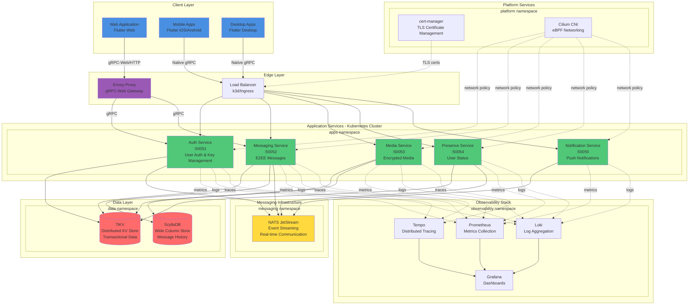
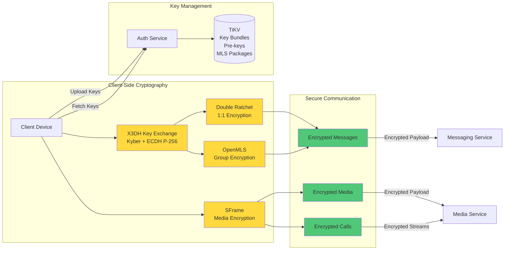
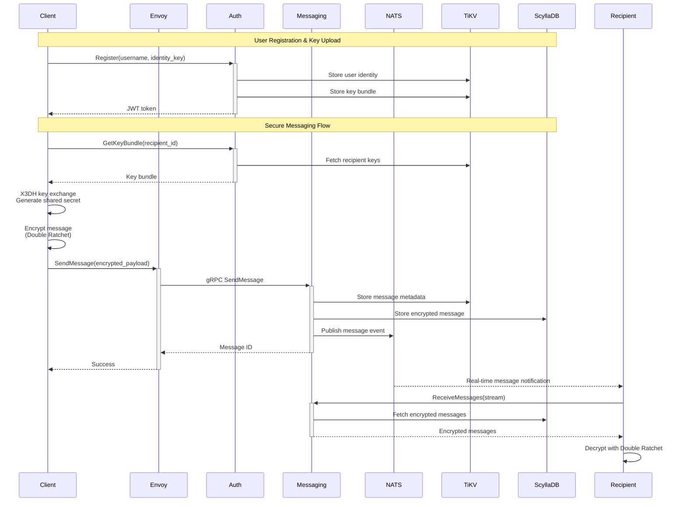
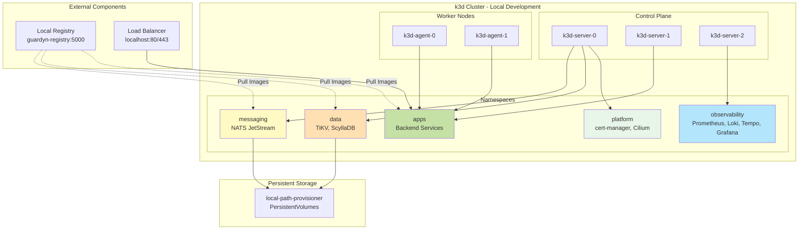
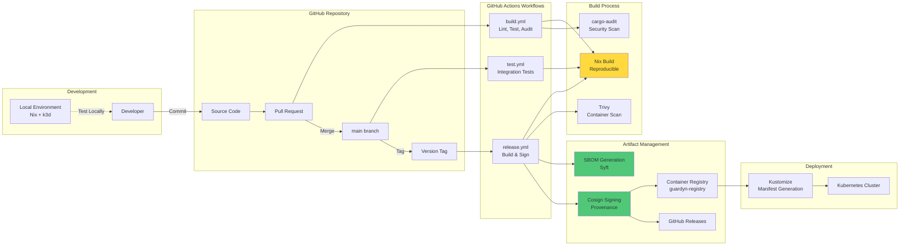
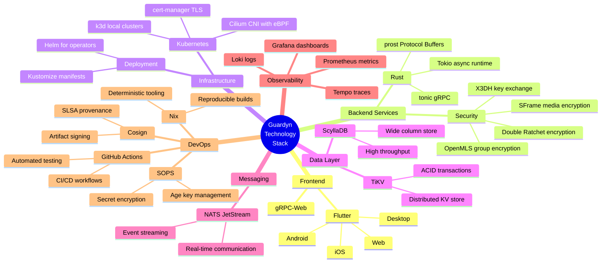
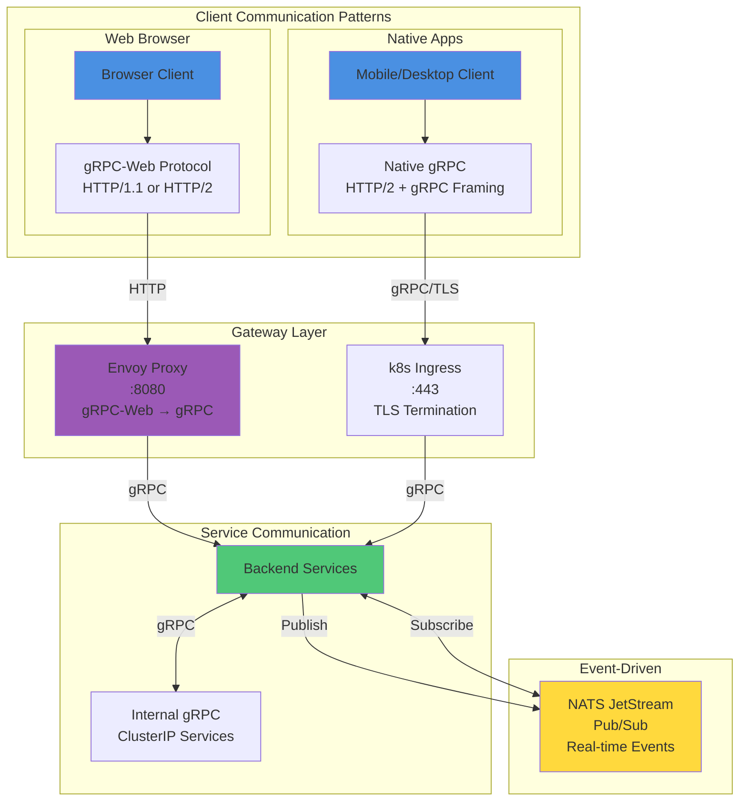

# Guardyn Architecture

This document provides a comprehensive overview of the Guardyn platform architecture using Mermaid diagrams.

## High-Level Architecture Overview

## Security Architecture

## Data Flow Architecture

## Kubernetes Deployment Architecture

## CI/CD Pipeline Architecture

## Technology Stack

## Network Communication Patterns

## Key Design Principles

1. **Privacy-First**: End-to-end encryption for all user communications using X3DH, Double Ratchet, and OpenMLS
2. **Reproducible Builds**: Nix flakes ensure deterministic builds and audit-ready artifacts
3. **Kubernetes-Native**: All infrastructure managed with Kustomize and Helm operators
4. **Domain-Agnostic**: Single `DOMAIN` variable configures all services for any deployment
5. **Observability**: Comprehensive metrics, logs, and traces via Prometheus, Loki, and Tempo
6. **Security by Design**: SOPS encryption for secrets, Cosign signing for artifacts, regular security audits
7. **Local Development Parity**: k3d clusters mirror production topology for consistent testing
8. **Microservices Architecture**: Independently deployable services with clear boundaries
9. **Event-Driven Communication**: NATS JetStream for real-time messaging and loose coupling
10. **Multi-Platform Support**: Flutter clients for web, mobile, and desktop with unified codebase
