# Guardyn Encryption Architecture

This document provides a comprehensive technical overview of the encryption mechanisms used in Guardyn, including detailed diagrams and protocol descriptions.

## Table of Contents

1. [Encryption Overview](#encryption-overview)
2. [X3DH Key Exchange Protocol](#x3dh-key-exchange-protocol)
3. [Double Ratchet Algorithm](#double-ratchet-algorithm)
4. [MLS Group Encryption](#mls-group-encryption)
5. [End-to-End Encryption Flow](#end-to-end-encryption-flow)
6. [Key Storage and Management](#key-storage-and-management)
7. [Security Properties](#security-properties)

---

## Encryption Overview

Guardyn implements a multi-layer encryption architecture based on the Signal Protocol and OpenMLS standards. The system provides:

- **1-on-1 Messaging**: X3DH + Double Ratchet (Signal Protocol)
- **Group Messaging**: OpenMLS (IETF RFC 9420)
- **Media Encryption**: SFrame for voice/video calls (planned)

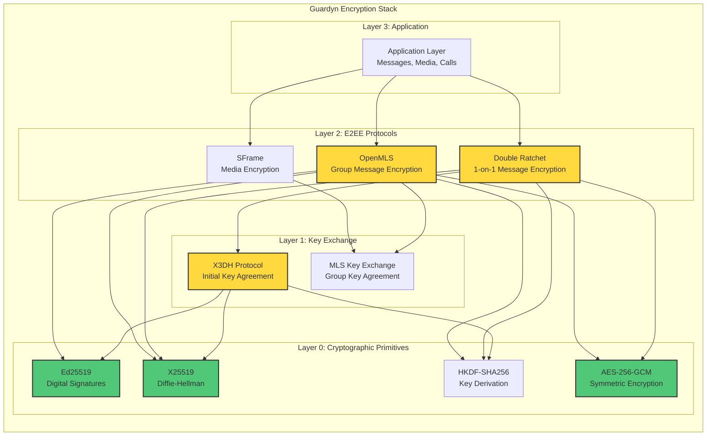

---

## X3DH Key Exchange Protocol

X3DH (Extended Triple Diffie-Hellman) is used to establish initial shared secrets between two parties. It provides **asynchronous key agreement**, meaning Alice can initiate a secure session with Bob even if Bob is offline.

### Key Types in X3DH

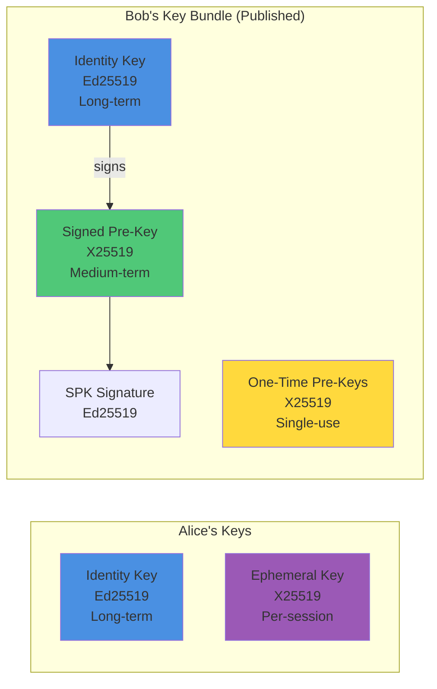

### X3DH Key Bundle Structure

| Key Type               | Algorithm | Lifetime    | Purpose                           |
| ---------------------- | --------- | ----------- | --------------------------------- |
| Identity Key (IK)      | Ed25519*  | Permanent   | Long-term identity verification   |
| Signed Pre-Key (SPK)   | X25519    | 1-4 weeks   | Medium-term key agreement         |
| SPK Signature          | Ed25519   | Same as SPK | Proves SPK authenticity           |
| One-Time Pre-Key (OPK) | X25519    | Single use  | Forward secrecy for first message |

> **\*Important Note on Identity Keys:** The Identity Key is stored as Ed25519 for digital signatures, but for Diffie-Hellman operations it is converted to X25519 using **Birational Equivalence mapping** between the twisted Edwards curve (Ed25519) and Montgomery curve (X25519). This is the same approach used by Signal Protocol.
>
> **Conversion Details:**
> - **Public key conversion:** Uses the formula `X_mont = (1 + Y_ed) / (1 - Y_ed) mod p` where `Y_ed` is the Ed25519 y-coordinate
> - **Secret key conversion:** The Ed25519 seed is hashed with SHA-512, then the first 32 bytes are clamped for X25519 use
> - **Rust implementation:** Uses `ed25519_dalek::VerifyingKey::to_montgomery()` and `SigningKey::to_scalar_bytes()`
> - **Dart implementation:** Uses `pinenacl` library's `TweetNaClExt.crypto_sign_ed25519_pk_to_x25519_pk()` and `crypto_sign_ed25519_sk_to_x25519_sk()`

### X3DH Protocol Flow

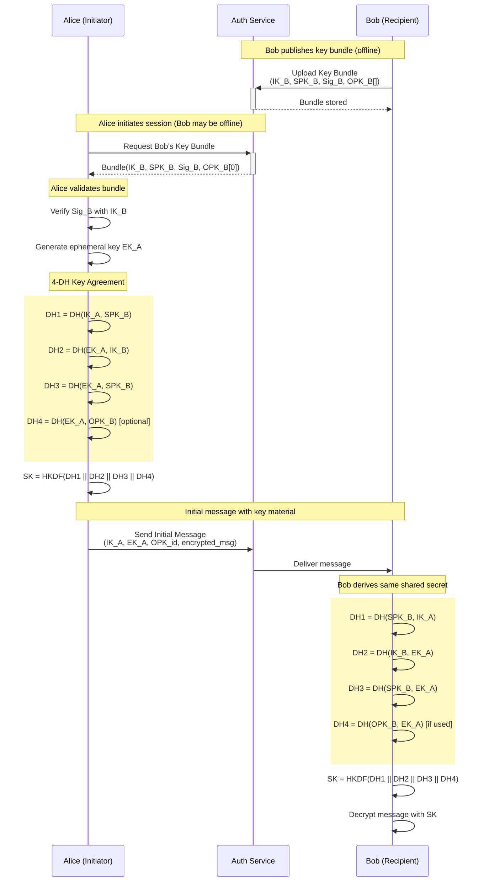

### X3DH Shared Secret Derivation

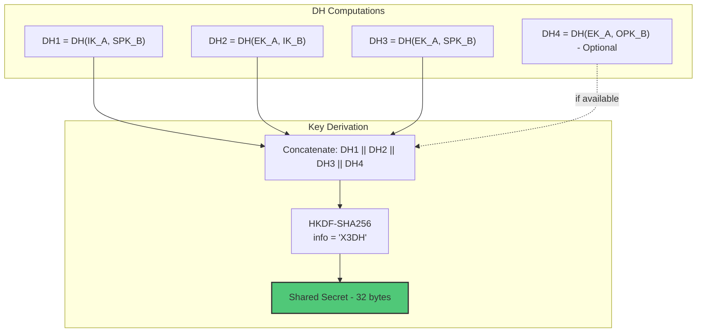

> **HKDF Parameters (X3DH Initial Key Agreement):**
>
> - **Hash**: SHA-256
> - **Salt**: None (empty)
> - **IKM**: DH1 || DH2 || DH3 [|| DH4]
> - **Info**: `"X3DH"` (ASCII bytes)
> - **Output Length**: 32 bytes

---

## Double Ratchet Algorithm

The Double Ratchet provides **forward secrecy** and **post-compromise security** for ongoing conversations. It combines:

1. **DH Ratchet**: Generates new key material on each message exchange
2. **Symmetric Ratchet**: Derives message keys from chain keys

### Double Ratchet Architecture

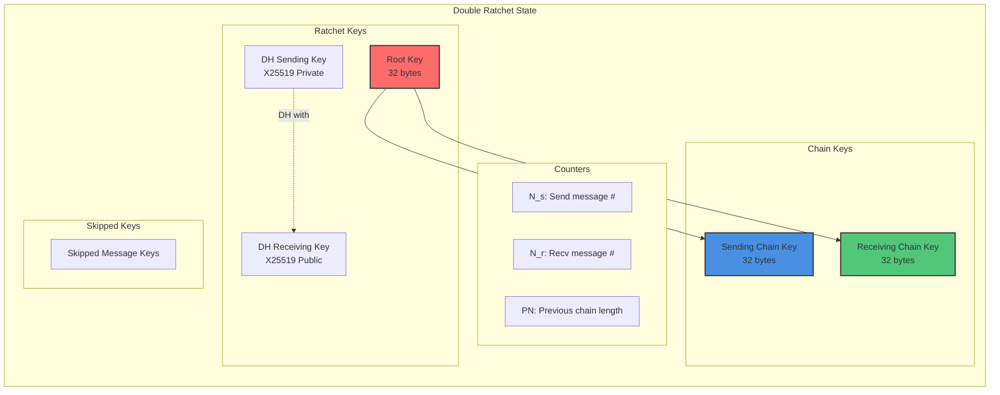

### DH Ratchet Step

The DH ratchet generates fresh key material whenever a new DH public key is received:

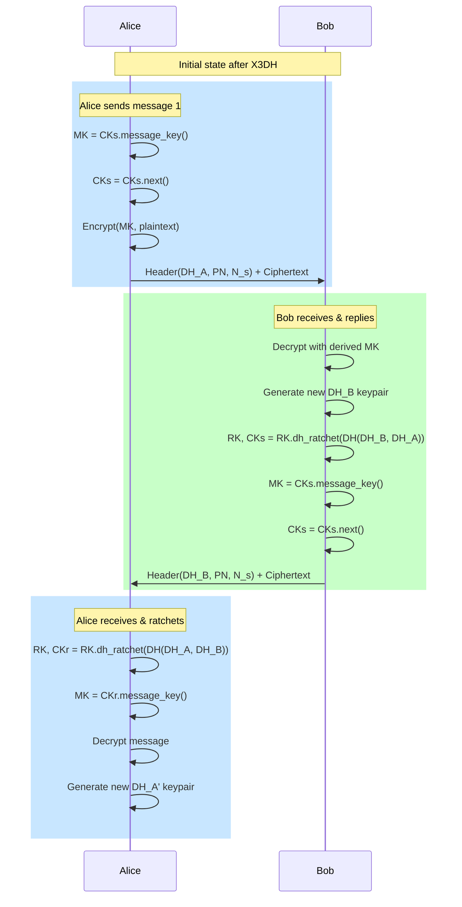

### HKDF Parameters for Double Ratchet

The Double Ratchet uses different HKDF configurations for different key derivation operations:

> **DH Ratchet (Root Key Update):**
>
> - **Hash**: SHA-256
> - **Salt**: Current Root Key (32 bytes)
> - **IKM**: DH output from X25519 exchange
> - **Info**: `"guardyn-root-key"` (ASCII bytes)
> - **Output Length**: 64 bytes (split: first 32 bytes → new Root Key, last 32 bytes → new Chain Key)

> **Symmetric Ratchet (Chain Key → Next Chain Key):**
>
> - **Hash**: SHA-256
> - **Salt**: None (empty)
> - **IKM**: Current Chain Key (32 bytes)
> - **Info**: `"guardyn-chain-key"` (ASCII bytes)
> - **Output Length**: 32 bytes

> **Symmetric Ratchet (Chain Key → Message Key):**
>
> - **Hash**: SHA-256
> - **Salt**: None (empty)
> - **IKM**: Current Chain Key (32 bytes)
> - **Info**: `"guardyn-message-key"` (ASCII bytes)
> - **Output Length**: 32 bytes

### Symmetric Ratchet (Chain Key Derivation)

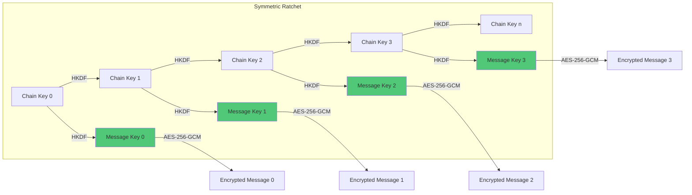

### Message Encryption/Decryption

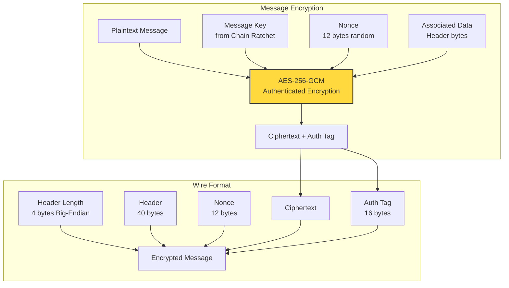

### Message Header Structure

| Field                 | Size         | Description                         |
| --------------------- | ------------ | ----------------------------------- |
| DH Public Key         | 32 bytes     | Current ratchet public key (X25519) |
| Previous Chain Length | 4 bytes      | Messages sent on previous chain     |
| Message Number        | 4 bytes      | Message index in current chain      |
| **Total**             | **40 bytes** | Header size                         |

### Encrypted Message Wire Format

| Field         | Size              | Description                                |
| ------------- | ----------------- | ------------------------------------------ |
| Header Length | 4 bytes           | Length of header (Big-Endian)              |
| Header        | 40 bytes          | Message header (see above)                 |
| Nonce         | 12 bytes          | Random nonce for AES-GCM                   |
| Ciphertext    | Variable          | Encrypted message content                  |
| Auth Tag      | 16 bytes          | AES-GCM authentication tag                 |
| **Total**     | **72 + N bytes**  | Where N is plaintext length                |

> **Note:** Integer fields (Previous Chain Length, Message Number) are encoded in **Big-Endian (Network Byte Order)** per RFC 1700 for cross-platform compatibility.

> **Security Note:** Each message uses a **cryptographically secure random 12-byte nonce** generated via `OsRng` (Rust) / `Random.secure()` (Dart). The nonce is prepended to the ciphertext, ensuring unique encryption even when the same message key is used (which should never happen in Double Ratchet, but defense-in-depth).

---

## MLS Group Encryption

OpenMLS (RFC 9420) provides scalable group encryption with efficient member management:

### MLS Tree Structure

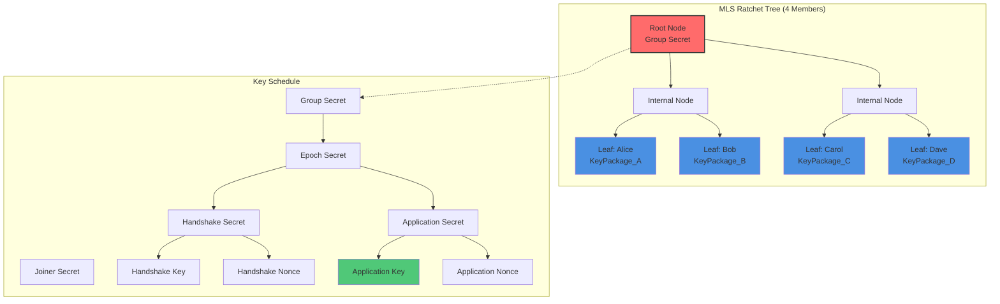

### MLS Group Lifecycle

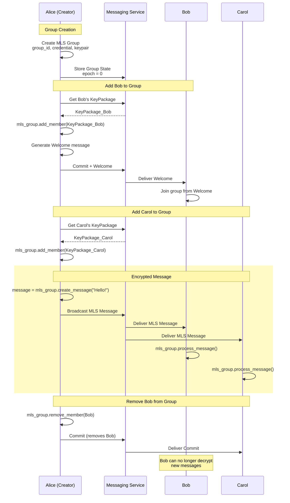

### MLS Key Package Structure

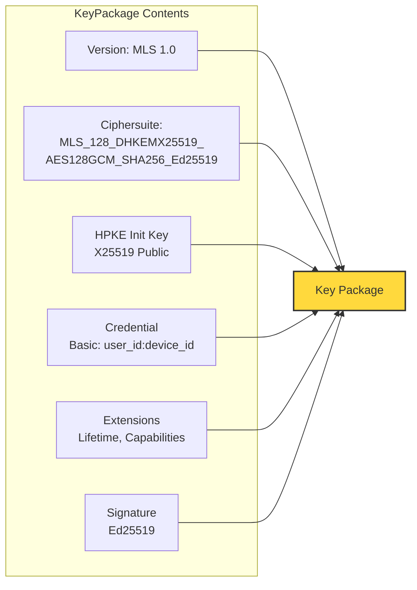

### MLS Ciphersuite

Guardyn uses `MLS_128_DHKEMX25519_AES128GCM_SHA256_Ed25519`:

| Component | Algorithm   | Purpose            |
| --------- | ----------- | ------------------ |
| HPKE KEM  | X25519      | Key encapsulation  |
| AEAD      | AES-128-GCM | Message encryption |
| Hash      | SHA-256     | Key derivation     |
| Signature | Ed25519     | Authentication     |

> **Note on AES Key Sizes:** MLS uses **AES-128-GCM** (128-bit keys) as specified in RFC 9420 for the `MLS_128_*` ciphersuites, which provides approximately 128 bits of security. In contrast, the Double Ratchet protocol for 1-on-1 messaging uses **AES-256-GCM** (256-bit keys), providing approximately 256 bits of security. Both are considered secure for current and near-future threats. The choice of AES-128 for MLS aligns with the standard ciphersuite definitions, while AES-256 for Double Ratchet provides an extra security margin for long-term message confidentiality.

---

## End-to-End Encryption Flow

### Complete 1-on-1 Message Flow

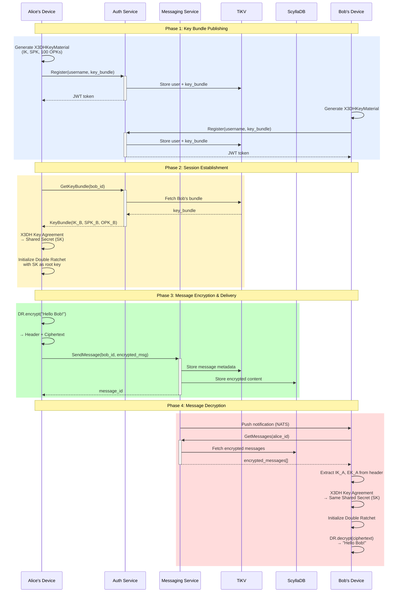

### Group Message Flow

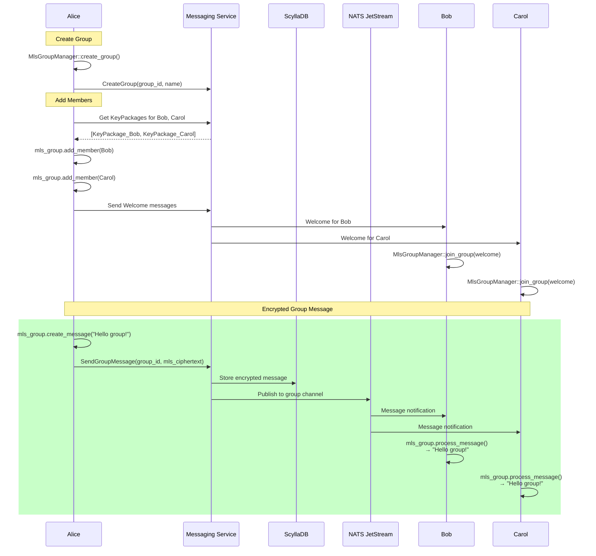

---

## Key Storage and Management

### Key Storage Architecture

```mermaid
graph TB
    subgraph "Client-Side (Secure Storage)"
        direction TB
        SecureStorage[Secure Enclave / Keychain]

        IK_Priv[Identity Private Key<br/>Ed25519]
        SPK_Priv[Signed Pre-Key Private<br/>X25519]
        OPK_Priv[One-Time Pre-Keys Private<br/>X25519 × 100]
        DR_State[Double Ratchet States<br/>Per conversation]
        MLS_State[MLS Group States<br/>Per group]

        SecureStorage --> IK_Priv
        SecureStorage --> SPK_Priv
        SecureStorage --> OPK_Priv
        SecureStorage --> DR_State
        SecureStorage --> MLS_State
    end

    subgraph "Server-Side (TiKV)"
        direction TB

        KeyBundles[(Key Bundles<br/>Public keys only)]
        MLSPackages[(MLS Key Packages<br/>Public packages)]

        subgraph "Stored Data"
            IK_Pub[Identity Public Key]
            SPK_Pub[Signed Pre-Key Public]
            SPK_Sig[SPK Signature]
            OPK_Pub[One-Time Pre-Keys Public]
            KP[MLS Key Packages]
        end

        KeyBundles --> IK_Pub
        KeyBundles --> SPK_Pub
        KeyBundles --> SPK_Sig
        KeyBundles --> OPK_Pub
        MLSPackages --> KP
    end

    subgraph "Message Storage (ScyllaDB)"
        Messages[(Encrypted Messages<br/>Ciphertext only)]

        Note1[Server CANNOT decrypt:<br/>- No access to private keys<br/>- No access to shared secrets<br/>- Only stores opaque blobs]
    end

    style SecureStorage fill:#50C878,stroke:#333,stroke-width:2px
    style Messages fill:#FF6B6B,stroke:#333,stroke-width:2px
```

### Key Lifecycle

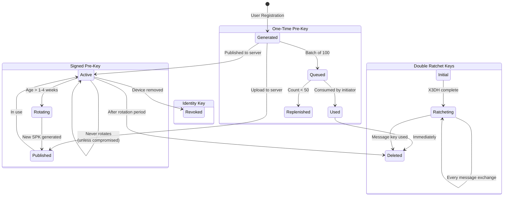

---

## Security Properties

### Encryption Guarantees

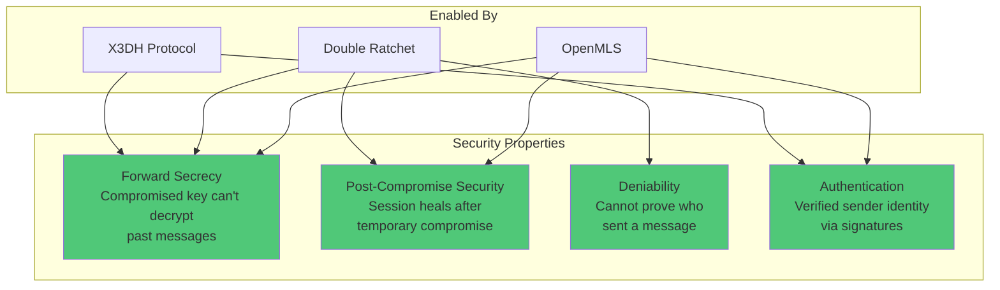

### What the Server CAN and CANNOT See

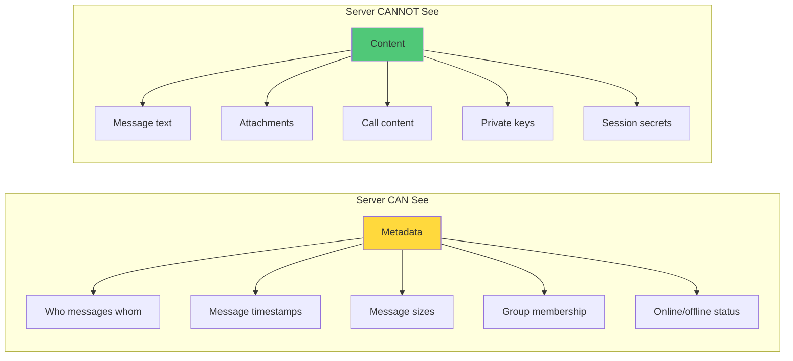

### Cryptographic Primitive Summary

| Primitive          | Algorithm   | Key Size | Purpose                  |
| ------------------ | ----------- | -------- | ------------------------ |
| Identity Signing   | Ed25519     | 256-bit  | Long-term identity       |
| Key Agreement      | X25519      | 256-bit  | Diffie-Hellman           |
| Message Encryption | AES-256-GCM | 256-bit  | Symmetric encryption     |
| Key Derivation     | HKDF-SHA256 | 256-bit  | Derive keys from secrets |
| MLS AEAD           | AES-128-GCM | 128-bit  | Group message encryption |
| MLS Signatures     | Ed25519     | 256-bit  | Group operations         |

---

## Implementation References

### Backend (Rust)

| File                                          | Description                      |
| --------------------------------------------- | -------------------------------- |
| `backend/crates/crypto/src/x3dh.rs`           | X3DH key exchange implementation |
| `backend/crates/crypto/src/double_ratchet.rs` | Double Ratchet algorithm         |
| `backend/crates/crypto/src/mls.rs`            | OpenMLS group encryption         |
| `backend/crates/crypto/src/key_storage.rs`    | Key storage interface            |

### Flutter Client (Dart)

| File                                           | Description                              |
| ---------------------------------------------- | ---------------------------------------- |
| `client/lib/core/crypto/double_ratchet.dart`   | Double Ratchet + X25519KeyPair           |
| `client/lib/core/crypto/x3dh.dart`             | X3DH key exchange + IdentityKeyPair      |
| `client/lib/core/crypto/crypto_service.dart`   | High-level encryption service            |
| `client/lib/core/crypto/crypto_exceptions.dart`| Crypto-specific exception types          |

### Protocol Definitions

| File                            | Description                     |
| ------------------------------- | ------------------------------- |
| `backend/proto/auth.proto`      | Key bundle upload/download RPCs |
| `backend/proto/messaging.proto` | Encrypted message handling RPCs |

---

## Further Reading

- [Signal Protocol Specification](https://signal.org/docs/)
- [OpenMLS RFC 9420](https://datatracker.ietf.org/doc/rfc9420/)
- [X3DH Key Agreement Protocol](https://signal.org/docs/specifications/x3dh/)
- [Double Ratchet Algorithm](https://signal.org/docs/specifications/doubleratchet/)
- [Guardyn Implementation Plan](./IMPLEMENTATION_PLAN.md)
