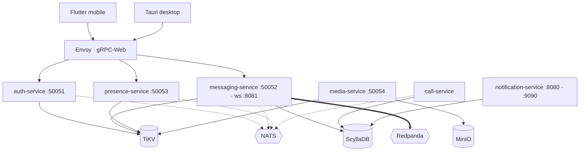

# Software Architecture Document

The blueprint: what exists, where it runs, and which store owns which concern. Behaviour
and edge cases live in [`SRS.md`](SRS.md); *why* a decision was taken lives in
[`../adr/index.md`](../adr/index.md). This file records the shape.

Everything here was read out of the tree. Where the running system and this document
disagree, the tree is right — fix this file.

## Shape

Dotted edges are ephemeral signalling; the double edge is the durable log.

## Crates

Ten members in the `backend/` workspace.

| Crate | Kind | Depends on | Role |
|---|---|---|---|
| `auth-service` | binary | common, crypto | Identity, devices, contacts, key bundles. 13 handlers. |
| `messaging-service` | binary | common, crypto | Messages, conversations, groups, reactions, receipts. 32 handlers. |
| `presence-service` | binary | common | Reachability and status. 8 handlers. |
| `media-service` | binary | common | Encrypted blob upload and retrieval. 8 handlers. |
| `call-service` | binary | common, crypto | Call signalling and SFrame key exchange. |
| `notification-service` | binary | common | Push delivery and settings. |
| `common` | library | — | Config, errors, observability, Kafka, rate limiting, event envelopes. |
| `crypto` | library | common | X3DH, Double Ratchet, PQXDH, MLS, sealed sender, PADMÉ padding, key storage. |
| `crypto-ffi` | library | crypto | Flutter and Tauri bindings via flutter_rust_bridge. |
| `e2e-tests` | test | — | Cross-service integration tests. |

`common` and `crypto` are the only libraries every service is allowed to share. A service
must not depend on another service.

## Store per concern

Four stores, each with one job. Adding, replacing or removing one requires an accepted ADR
**and** explicit user approval.

| Store | Owns | Why not something else |
|---|---|---|
| **TiKV** | Auth records, device registry, contacts, key bundles, MLS group state | Transactional KV with range scans; deliberately **not** PostgreSQL (ADR-0001) |
| **ScyllaDB** | Message, call and notification history | Wide-column, write-heavy, time-ordered partitions (ADR-0002) |
| **MinIO** | Encrypted media blobs, via `aws-sdk-s3` | S3 API, self-hostable — I-4 forbids a managed-only dependency |
| **Redpanda** | The durable event log | Kafka protocol without the JVM |

**Dragonfly/Redis is deliberately absent**, deferred post-launch (ADR-0006). Do not
introduce a cache layer to "fix" a latency observation.

## Two buses, on purpose

| Bus | Carries | Delivery |
|---|---|---|
| **NATS** | Ephemeral signalling: presence beats, call setup, live fan-out | At-most-once, no replay |
| **Redpanda** | Durable events via `EventEnvelope` | Persisted, replayable, ordered per partition |

They are not redundant and must not be consolidated. A presence beat that is lost is
correct behaviour; a message event that is lost is data loss.

## Edge

Envoy terminates gRPC-Web and routes to `guardyn.auth.AuthService`,
`guardyn.messaging.MessagingService` and `guardyn.presence.PresenceService`. Browsers
cannot speak gRPC over HTTP/2 trailers directly, so every web and desktop client reaches
the backend through it.

All hostnames derive from `${DOMAIN}`. No subdomain layout is assumed and no TLD is
hardcoded — this is how I-4 is honoured in practice.

## Wire contract

`backend/proto/*.proto` is canonical: 7 files, 6 services, **94 RPCs**.

| Proto | Service | RPCs |
|---|---|---|
| `auth.proto` | AuthService | 19 |
| `messaging.proto` | MessagingService | 34 |
| `calls.proto` | CallService | 18 |
| `media.proto` | MediaService | 8 |
| `notifications.proto` | NotificationService | 8 |
| `presence.proto` | PresenceService | 7 |
| `common.proto` | — | shared types and `ErrorCode` |

Change the proto, then regenerate. Never hand-edit generated output, and never invent an
enum variant.

## Data flow — sending a message

1. Client encrypts on-device. The server never sees plaintext (**I-1**).
2. gRPC-Web → Envoy → `messaging-service`.
3. Recipient key material is fetched from `auth-service` (TiKV) if no session exists.
4. Ciphertext is written to ScyllaDB and an `EventEnvelope` is produced to Redpanda.
5. Live delivery goes out over NATS, or the WebSocket on `:8081` for a connected client.
6. `notification-service` consumes the durable event and pushes to offline devices.

At no point does a payload, a key, or decrypted metadata reach a log, a span, or a metric
label.

## Deployment

`infra/k8s/base/` holds namespaces, apps, Envoy, TiKV, ScyllaDB, MinIO, cert-manager,
Cilium, monitoring and observability. `overlays/local` and `overlays/prod` layer on top;
prod adds HPA, PDB, ingress, network policies, service monitors, SLO rules and
alertmanager configuration.

`docker-compose.dev.yml` is the single-machine equivalent: nine infrastructure containers
(`nats`, `redpanda`, `redpanda-console`, `pd`, `tikv`, `scylladb`, `minio`, `minio-init`,
`envoy`) plus the six services.

## Known structural gaps

Recorded here because a blueprint that hides its holes is not a blueprint.

| Gap | Consequence | Owned by |
|---|---|---|
| No `call-service` Deployment in `infra/k8s/base/apps/` | call-service runs under Compose but is not deployable to Kubernetes | PR-44 |
| Envoy routes only 3 of 6 services | media, calls and notifications are unreachable from a browser client | PR-44 |
| `notification-service` and `call-service` have no `handlers/` directory | they break the one-handler-per-file rule and are the two services bypassing `observability::init_tracing` | PR-26, PR-35 |
| Generated protobuf is committed in two places — `backend/crates/*/src/generated/` (13 files) and `client-desktop/src-tauri/src/proto/` (8 files) — while `messaging-service` uses `include_proto!` | three codegen strategies coexist | PR-23 |
| `RateLimiter` is process-local | rate limits multiply by replica count | PR-41 |
| `infra/k8s/base/envoy/ingress.yaml` hardcodes `envoy.guardyn.local` | violates the `${DOMAIN}` rule | unowned |
